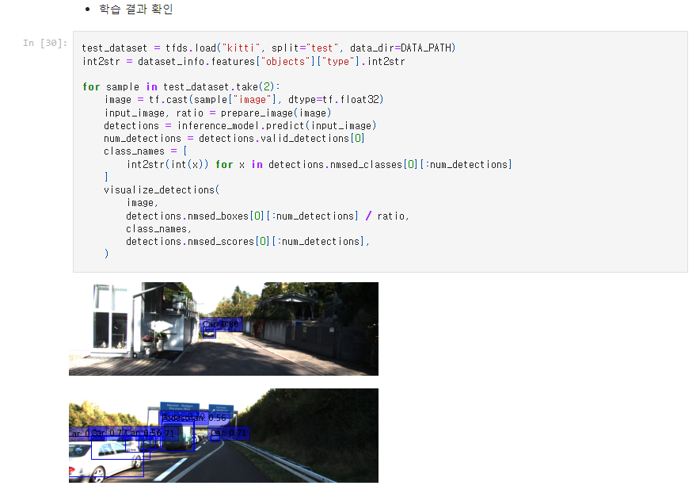
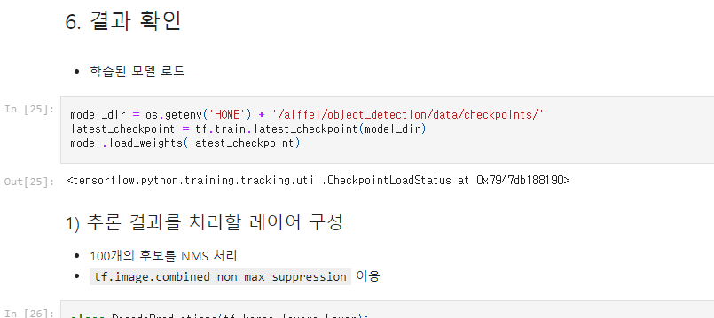
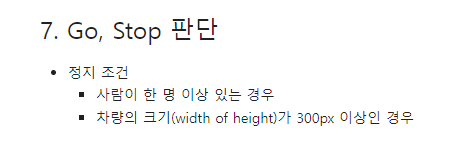
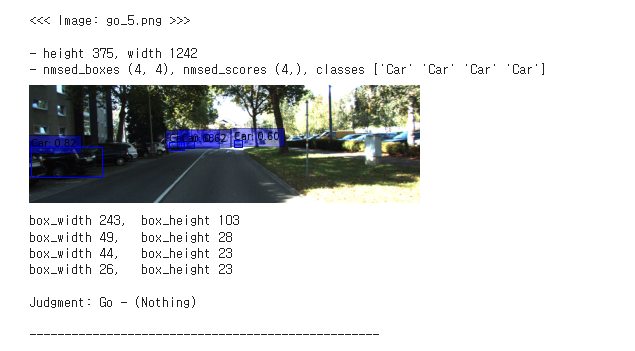
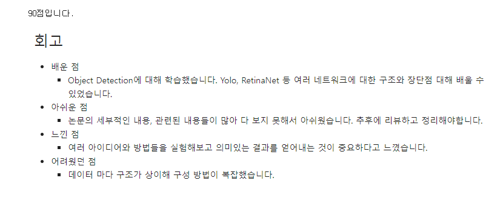

# AIFFEL Campus Online Code Peer Review Templete
- 코더 : 권영찬
- 리뷰어 : 신재현

🔑 **PRT(Peer Review Template)**

- [X]  **1. 주어진 문제를 해결하는 완성된 코드가 제출되었나요? (완성도)**
    - 문제에서 요구하는 최종 결과물이 첨부되었는지 확인
    - 문제를 해결하는 완성된 코드란 프로젝트 루브릭 3개 중 2개, 
    퀘스트 문제 요구조건 등을 지칭
        - 해당 조건을 만족하는 부분의 코드 및 결과물을 캡쳐하여 사진으로 첨부

실행된 결과물들이 1epoch이 밎기지 않을정도로 정확하게 나온거 같아 코드를 좀더 리뷰해봐야 어떻게 구현됬는지 알 수 있을거 같습니다.

- [X]  **2. 프로젝트에서 핵심적인 부분에 대한 설명이 주석(닥스트링) 및 마크다운 형태로 잘 기록되어있나요? (설명)**
    - [ ]  모델 선정 이유
    - [ ]  Metrics 선정 이유
    - [ ]  Loss 선정 이유

중간 로직등을 어떻게 구상하였는지 그리고 전체적인 코드 정리가 깔끔하게 처리되어 있습니다.

Go, Stop의 로직을 왜 사용했는지 등의 구상을 효율적으로 하셨습니다.

다만 어떤 로직을 썼는지 모델 선정했는지 등을 프로젝트 특성상 때로 지정하는 것이 아닌 주어진 환경이기에 해당사항 없습니다.

- [X]  **3. 체크리스트에 해당하는 항목들을 모두 수행하였나요? (문제 해결)**
    - [X]  데이터를 분할하여 프로젝트를 진행했나요? (train, validation, test 데이터로 구분)
    - [X]  하이퍼파라미터를 변경해가며 여러 시도를 했나요? (learning rate, dropout rate, unit, batch size, epoch 등)
    - [X]  각 실험을 시각화하여 비교하였나요?
    - [X]  모든 실험 결과가 기록되었나요?

    각 실험과정들의 결과들이 보기좋게 잘 기록되어 있습니다.
    

- [X]  **4. 프로젝트에 대한 회고가 상세히 기록 되어 있나요? (회고, 정리)**
    - [x]  배운 점
    - [X]  아쉬운 점
    - [X]  느낀 점
    - [X]  어려웠던 점

